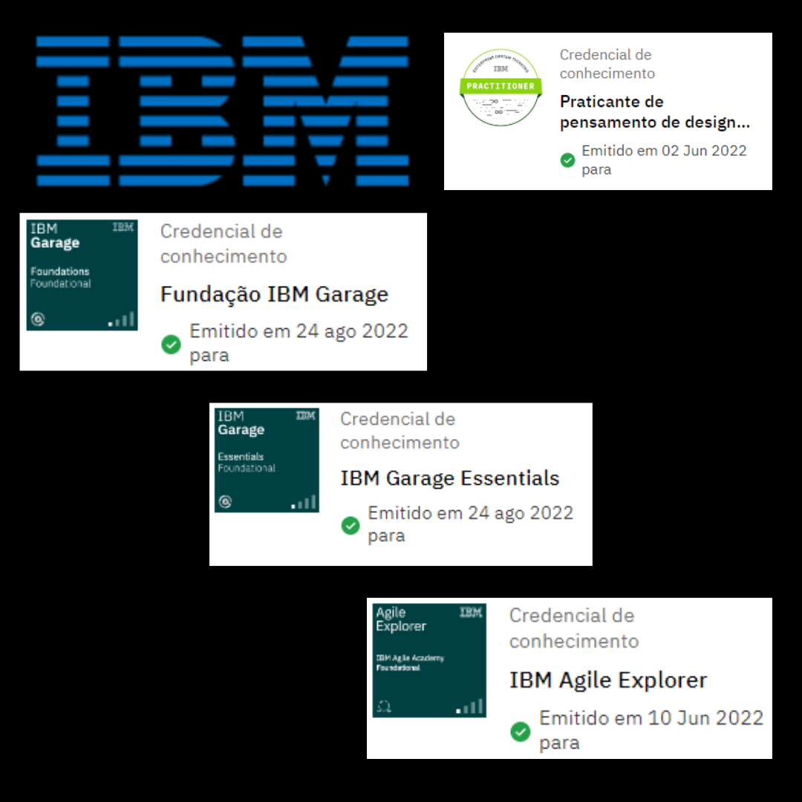

# Olá! Bem vindo ao meu GitHub.🙋‍♀️    

&nbsp;&nbsp;

Meu nome é **<i>Renata</i>**.👩‍💻
  

 - 🌍Sou brasileira;
 - 💻Graduanda em Análise e desenvolvimento de sistemas na Estácio.
 - 💻Graduanda em Tecnologia em sistemas da computação na UFF.
 - 🎓Técnica em Redes de computadores no SENAI.
 

## 👩🏻‍💻 Habilidades
### Logic

### Back-end

     

### Front-end
 

### Git

### Operational Systems
  

##

 

 
 
 
