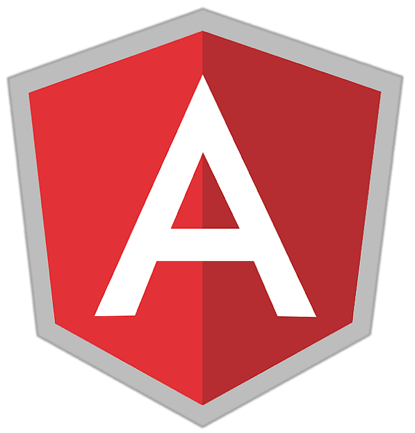

# Olá! Bem vindo ao meu GitHub. :sunglasses:    

Meu nome é **<i>Renata</i>**.👩‍💻

 - :star: Cursando Bacharelado em Ciência da Computação - Universidade Estácio de Sá. 
 - :star: Formada na graduação tecnológica especializada em Análise e desenvolvimento de sistemas - Universidade Estácio de Sá.
 - :star: Técnica em Redes de computadores - SENAI/RJ.

## 👩🏻‍💻 Habilidades

### Logic

### Back-end

      

### Front-end
  

### Git

### Operational Systems
  

## 👩🏻‍💻 Estágio na IBM - período: Julho/2021 até Julho/2023.
Atividades desempenhadas durante o estágio:
QA - Quality Assurance:  em Quality Assurance (QA) na IBM desempenhamos a garantia da qualidade dos produtos e serviços da empresa, através de execução de casos de teste pré-definidos, verificando se o software funciona conforme o esperado pelo cliente, identificamos e registramos bugs e falhas no sistema, assim como verificamos incompatibilidades do sistema com sua documentação, criamos relatórios detalhados sobre os resultados dos testes para atestar a subida para produção ou não. 
Maior detalhamento:
Análise de requisitos:
Leitura e compreensão dos requisitos funcionais e não funcionais do software.
Criação de casos de teste baseados nos requisitos.
Automação de testes:
Desenvolvimento de scripts de teste automatizados para aumentar a eficiência e cobertura dos testes (no meu caso: Python). 
Participação em reuniões:
Participação em reuniões de planejamento, acompanhamento e revisão de projetos. Apresentação dos resultados dos testes para a equipe.
Geração de relatórios:
Criação de relatórios concisos e informativos sobre a qualidade do software, incluindo métricas e indicadores de desempenho.

 

 Design thinking "na veia"  😎

 Design thinking é uma metodologia de resolução de problemas que foca no usuário, tendo empatia por ele e determinando a melhor experiência que o usuário pode ter.

 🕵🏽‍♀️ identifique o problema

 👩🏽‍💼 determine os objetivos do projeto

 👩🏽‍💻 desenvolva personas que simulem usuários finais

 ✍🏽 documente os requisitos da solução

 ## :octocat: Como estamos no Git Hub, aí vai algumas observações: :feet:

 O git é um sistema de controle de versão para rastrear alterações no código-fonte durante o desenvolvimento de software, ele é instalado localmente em um computador.

 O git hub é um serviço online que fornece um lugar para hospedar código-fonte, bem como contribuir e colaborar. 
 
 
